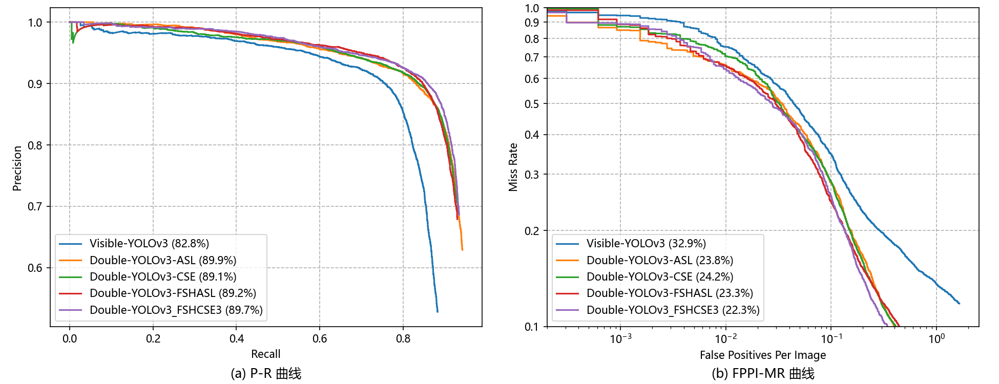

# 一种基于YOLOv3/4的混合模态行人检测算法

## 一、KAIST数据集说明

Train：

- [ ] Set 00 / Day / Campus / 5.92GB / 17,498 frames / 11,016 objects [jpg]
  **0.6296** objects/frame **1759**

- [ ] Set 01 / Day / Road / 2.82GB / 8,035 frames / 8,550 objects [jpg]
  **1.0641** objects/frame **913**

- [ ] Set 02 / Day / Downtown / 3.08GB / 7,866 frames / 11,493 objects [jpg]
  **1.4611** objects/frame **1624**

- [ ] Set 03 / Night / Campus / 2.40GB / 6,668 frames / 7,418 objects [jpg]
  **1.1125** objects/frame **1009**

- [ ] Set 04 / Night / Road / 2.88GB / 7,200 frames / 17,579 objects [jpg]
  **2.4415** objects/frame **956**

- [ ] Set 05 / Night / Downtown / 1.01GB / 2,920 frames / 4,655 objects [jpg]
  **1.5942** objects/frame **503**

Test：

- [x] Set 06 / Day / Campus / 4.78GB / 12,988 frames / 12,086 objects [jpg]
  **0.9306** objects/frame **1876**

- [ ] Set 07 / Day / Road / 3.04GB / 8,141 frames / 4,225 objects [jpg]
  **0.5190** objects/frame **726**

- [ ] Set 08 / Day / Downtown / 3.50GB / 8,050 frames / 23,309 objects [jpg]
  **2.8955** objects/frame **2054**

- [x] Set 09 / Night / Campus / 1.38GB / 3,500 frames / 3,577 objects [jpg]
  **1.0220** objects/frame **483**

- [x] Set 10 / Night / Road / 3.75GB / 8,902 frames / 4,987 objects [jpg]
  **0.5602** objects/frame **683**

- [ ] Set 11 / Night / Downtown / 1.33GB / 3,560 frames / 6,655 objects [jpg]
  **1.8694** objects/frame **785**

实验时所采用如上标号的数据集进行训练，并进行随机采样，默认取60%的数据作为训练数据集，取30%的数据作为验证集，取最后剩下的10%作为测试集，所有的图片都分为可见光和红外光图像两个版本。除此之外，在剩下的（主要是夜间场景下）数据集中我们还会抽取出部分的图像作为演示之用。

## 二、实验结果对比分析

实验设备采用CPU：`Intel(R) Xeon(R) Silver 4210R CPU @ 2.40GHz`，内存：`192G DDR4-3200MHz`，GPU：`Quadro RTX 6000@24220MiB × 2`。实验参数设置：超参数：`hyp['box']: 3.540, hyp['obj']: 102.880. hyp['cls']: 0.468`。

基于YOLOv3改进算法的实验以及对照实验的结果如下表所示：

|               算法模型名               | 全天候测试集AP@IoU=0.5  | 全天候测试集LAMR@IoU=0.5 | 白天测试集AP@IoU=0.5 | 白天测试集LAMR@IoU=0.5 | 夜间测试集AP@IoU=0.5 | 夜间测试集LAMR@IoU=0.5 | 检测速度FPS |
| :------------------------------------: | :---------------------: | :----------------------: | :------------------: | :--------------------: | :------------------: | :--------------------: | :---------: |
|         Visible-YOLOv3-Normal          |         82.80%          |          32.89%          |        87.98%        |         26.43%         |        76.68%        |         39.37%         |  **72.57**  |
|    Double-YOLOv3-Add-Self-Learning     |       **89.86%**        |          23.79%          |        90.25%        |         22.46%         |      **89.41%**      |         25.44%         |    44.22    |
|        Double-YOLOv3-Concat-SE         |         89.11%          |          24.19%          |        89.96%        |         22.33%         |        88.09%        |         26.49%         |    41.27    |
|   Double-YOLOv3-Concat-Inception-SE    |         89.52%          |          24.16%          |        89.88%        |         23.02%         |        89.12%        |         25.16%         |    36.31    |
|     Double-YOLOv3-Fshare-Concat-SE     |         89.35%          |          23.59%          |      **90.69%**      |         21.05%         |        87.77%        |         26.38%         |    35.38    |
| Double-YOLOv3-Global-Fshare-Concat-SE  |         89.54%          |          24.44%          |        90.17%        |         22.36%         |        88.87%        |         27.12%         |    40.11    |
| Double-YOLOv3-Global-Fshare-Concat-SE3 |         89.75%          |        **22.33%**        |        90.17%        |       **21.01%**       |        89.22%        |       **24.11%**       |    44.13    |
|   Double-YOLOv3-Global-Fshare-Add-SL   |         89.20%          |          23.28%          |        89.55%        |         21.99%         |        88.87%        |         24.76%         |    39.47    |
| 还缺少一个与别人设计算法的对比实验代做 |                         |                          |                      |                        |                      |                        |             |
|        Double-YOLOv3-Add-Simple        | 下面的部分实验不准备做❌ |                          |                      |                        |                      |                        |             |
|      Double-YOLOv4-Concat-Simple       |            ❌            |                          |                      |                        |                      |                        |             |
|     Double-YOLOv3-Concat-Residual      |            ❌            |                          |                      |                        |                      |                        |             |
|     Double-YOLOv3-Concat-Inception     |            ❌            |                          |                      |                        |                      |                        |             |

上述实验中较好算法模型得到的P-R曲线和FPPI-MR曲线如下图所示：

## 三、参考资料

- [【行人检测】miss rate versus false positives per image (FPPI) 前世今生（理论篇）](https://blog.csdn.net/weixin_38705903/article/details/109654157)
- [【行人检测】miss rate versus false positives per image (FPPI) 前世今生（实战篇-上）](https://blog.csdn.net/weixin_38705903/article/details/109684244)
- [【行人检测】miss rate versus false positives per image (FPPI) 前世今生（实战篇-下）](https://blog.csdn.net/weixin_38705903/article/details/109696278)
- [用matlab 画log Average Miss Rate - FPPI 曲线图，知识点总结](https://www.cnblogs.com/ya-cpp/p/8282383.html)
- [行人检测 FPPI miss rate怎么画？](https://www.zhihu.com/question/37633344)
- [MS COCO数据集介绍以及pycocotools简单使用](https://blog.csdn.net/qq_37541097/article/details/113247318?spm=1001.2014.3001.5502)
- [目标检测mAP计算以及coco评价标准](https://www.bilibili.com/video/BV1ez4y1X7g2?from=search&seid=1352019570332389778&spm_id_from=333.337.0.0)
- [COCO数据集介绍以及pycocotools简单使用](https://www.bilibili.com/video/BV1TK4y1o78H/?spm_id_from=333.788.recommend_more_video.0)
- [深度学习小技巧-mAP精度概念详解与计算绘制](https://www.bilibili.com/video/BV1zE411u7Vw?p=2)
