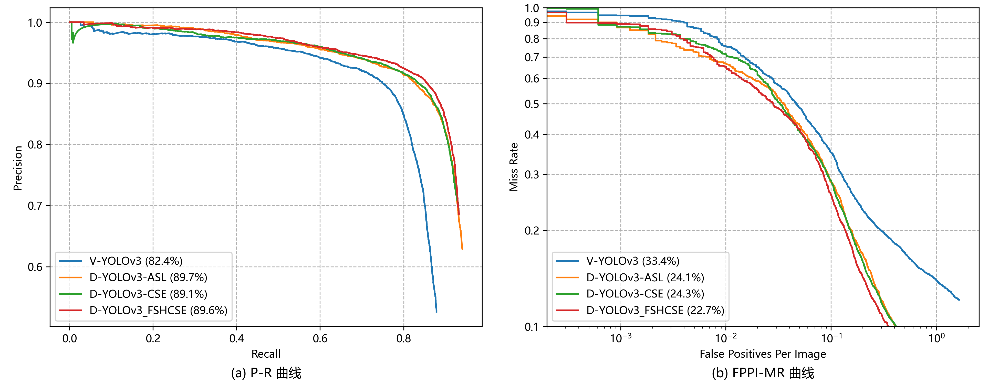

# 一种基于YOLOv3/4的混合模态行人检测算法

## 一、KAIST数据集说明

Train：

- [x] Set 00 / Day / Campus / 5.92GB / 17,498 frames / 11,016 objects [jpg]
  **0.6296** objects/frame **1759**

- [x] Set 01 / Day / Road / 2.82GB / 8,035 frames / 8,550 objects [jpg]
  **1.0641** objects/frame **913**

- [x] Set 02 / Day / Downtown / 3.08GB / 7,866 frames / 11,493 objects [jpg]
  **1.4611** objects/frame **1624**

- [x] Set 03 / Night / Campus / 2.40GB / 6,668 frames / 7,418 objects [jpg]
  **1.1125** objects/frame **1009**

- [x] Set 04 / Night / Road / 2.88GB / 7,200 frames / 17,579 objects [jpg]
  **2.4415** objects/frame **956**

- [x] Set 05 / Night / Downtown / 1.01GB / 2,920 frames / 4,655 objects [jpg]
  **1.5942** objects/frame **503**

Test：

- [ ] Set 06 / Day / Campus / 4.78GB / 12,988 frames / 12,086 objects [jpg]
  **0.9306** objects/frame **1876**

- [x] Set 07 / Day / Road / 3.04GB / 8,141 frames / 4,225 objects [jpg]
  **0.5190** objects/frame **726**

- [x] Set 08 / Day / Downtown / 3.50GB / 8,050 frames / 23,309 objects [jpg]
  **2.8955** objects/frame **2054**

- [ ] Set 09 / Night / Campus / 1.38GB / 3,500 frames / 3,577 objects [jpg]
  **1.0220** objects/frame **483**

- [ ] Set 10 / Night / Road / 3.75GB / 8,902 frames / 4,987 objects [jpg]
  **0.5602** objects/frame **683**

- [x] Set 11 / Night / Downtown / 1.33GB / 3,560 frames / 6,655 objects [jpg]
  **1.8694** objects/frame **785**

实验时所采用如上标号的数据集进行训练，并进行随机采样，默认取60%的数据作为训练数据集，取30%的数据作为验证集，取最后剩下的10%作为测试集，所有的图片都分为可见光和红外光图像两个版本。除此之外，在剩下的（主要是夜间场景下）数据集中我们还会抽取出部分的图像作为演示之用。

## 二、实验结果对比分析

实验设备采用CPU：`Intel(R) Xeon(R) Silver 4210R CPU @ 2.40GHz`，内存：`192G DDR4-3200MHz`，GPU：`Quadro RTX 6000@24220MiB × 2`。实验参数设置：超参数：`hyp['box']: 3.540, hyp['obj']: 102.880. hyp['cls']: 0.468`。

基于YOLOv3改进算法的实验以及对照实验的结果如下表所示：

|             算法模型名             | 全天候测试集AP@IoU=0.5 | 全天候测试集LAMR@IoU=0.5 | 白天测试集AP@IoU=0.5 | 白天测试集LAMR@IoU=0.5 | 夜间测试集AP@IoU=0.5 | 夜间测试集LAMR@IoU=0.5 | 检测速度FPS |
| :--------------------------------: | :--------------------: | :----------------------: | :------------------: | :--------------------: | :------------------: | :--------------------: | :---------: |
|       Visible-YOLOv3-Normal        |         82.42%         |          33.40%          |        87.72%        |         26.84%         |        76.15%        |         40.05%         |  **72.14**  |
|        Double-YOLOv3-Add-SL        |       **89.69%**       |          24.11%          |        90.34%        |         22.31%         |        88.94%        |         26.24%         |    43.94    |
|         Double-YOLOv3-CSE          |         89.05%         |          24.34%          |        90.02%        |         22.24%         |        87.88%        |         26.91%         |    42.19    |
| Double-YOLOv3-Concat-Inception-SE  |         89.13%         |          24.86%          |        89.63%        |         23.59%         |        88.56%        |         26.12%         |    34.56    |
|      Double-YOLOv3-Fshare-CSE      |         89.17%         |          23.84%          |      **90.46%**      |       **21.43%**       |        87.66%        |         26.57%         |    33.69    |
|  Double-YOLOv3-Global-Fshare-CSE   |         89.47%         |          24.51%          |        90.10%        |         22.44%         |        88.80%        |         27.15%         |    38.70    |
|  Double-YOLOv3-Global-Fshare-CSE3  |         89.58%         |        **22.65%**        |        89.93%        |         21.60%         |      **89.15%**      |       **24.12%**       |    42.57    |
| Double-YOLOv3-Global-Fshare-Add-SL |         89.14%         |          23.70%          |        89.44%        |         22.56%         |        88.88%        |         24.83%         |    41.07    |

上述实验中较好算法模型得到的P-R曲线和FPPI-MR曲线如下图所示：

基于YOLOv4改进算法的实验以及对照实验的结果如下表所示：

|            算法模型名            | 全天候测试集AP@IoU=0.5 | 全天候测试集LAMR@IoU=0.5 | 白天测试集AP@IoU=0.5 | 白天测试集LAMR@IoU=0.5 | 夜间测试集AP@IoU=0.5 | 夜间测试集LAMR@IoU=0.5 | 检测速度FPS |
| :------------------------------: | :--------------------: | :----------------------: | :------------------: | :--------------------: | :------------------: | :--------------------: | :---------: |
|      Visible-YOLOv4-Normal       |         84.72%         |          30.05%          |        89.07%        |         24.58%         |        79.57%        |         35.42%         |  **51.62**  |
|       Double-YOLOv4-Add-SL       |         89.09%         |          23.54%          |        88.96%        |         22.58%         |        89.28%        |         24.23%         |    30.30    |
|        Double-YOLOv4-CSE         |         89.79%         |          23.13%          |        90.05%        |         21.94%         |        89.50%        |         24.55%         |    29.91    |
| Double-YOLOv4-Fshare-Global-CSE3 |       **90.22%**       |        **20.31%**        |      **90.89%**      |       **18.71%**       |      **89.47%**      |       **22.25%**       |    29.04    |

所有模型性能对比图：

## 三、参考资料

- [【行人检测】miss rate versus false positives per image (FPPI) 前世今生（理论篇）](https://blog.csdn.net/weixin_38705903/article/details/109654157)
- [【行人检测】miss rate versus false positives per image (FPPI) 前世今生（实战篇-上）](https://blog.csdn.net/weixin_38705903/article/details/109684244)
- [【行人检测】miss rate versus false positives per image (FPPI) 前世今生（实战篇-下）](https://blog.csdn.net/weixin_38705903/article/details/109696278)
- [用matlab 画log Average Miss Rate - FPPI 曲线图，知识点总结](https://www.cnblogs.com/ya-cpp/p/8282383.html)
- [行人检测 FPPI miss rate怎么画？](https://www.zhihu.com/question/37633344)
- [MS COCO数据集介绍以及pycocotools简单使用](https://blog.csdn.net/qq_37541097/article/details/113247318?spm=1001.2014.3001.5502)
- [目标检测mAP计算以及coco评价标准](https://www.bilibili.com/video/BV1ez4y1X7g2?from=search&seid=1352019570332389778&spm_id_from=333.337.0.0)
- [COCO数据集介绍以及pycocotools简单使用](https://www.bilibili.com/video/BV1TK4y1o78H/?spm_id_from=333.788.recommend_more_video.0)
- [深度学习小技巧-mAP精度概念详解与计算绘制](https://www.bilibili.com/video/BV1zE411u7Vw?p=2)

