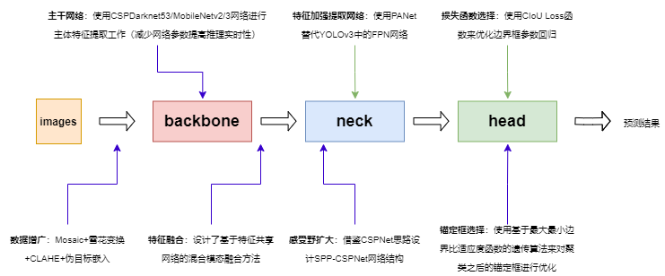
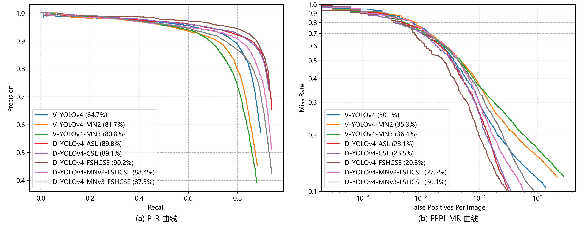
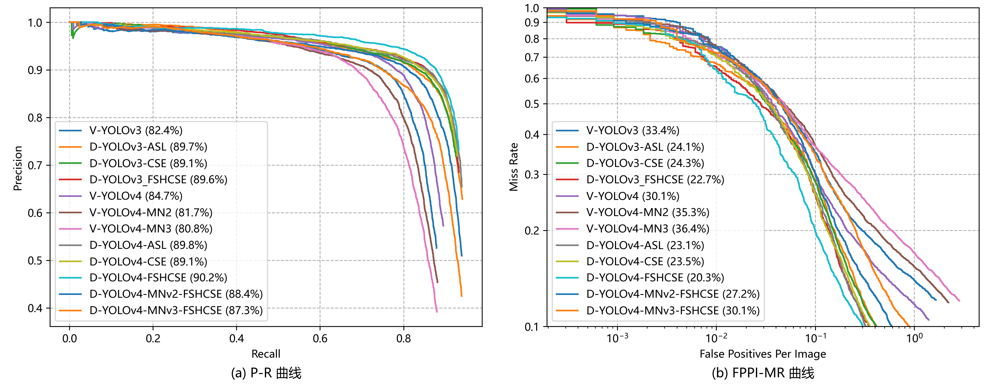

# 一种基于YOLOv3/4的混合模态行人检测算法

## 一、项目特性



- 在YOLOv4 Mosaic数据增广方法的基础上引入雪花变换、CLAHE以及伪目标嵌入等方法，提高网络泛化能力。
- 使用双流并行的CSPDarknet53网络从可见光和红外光图像中提取出各自的特征图。
- 设计了基于特征共享网络FSNet的混合模态特征融合方法，通过相互指导的方式实现红外光图像特征与可见光图像特征图的有效融合。
- 借鉴CSPNet的思路，在原先YOLOv4的SPP结构基础上改造成SPP-CSPNet来优化网路结构。
- 使用基于最大最小边界比MMBR适应度函数的遗传算法来优化锚定框的设置。
- 加入了MobileNetv2/3作为主干网络的轻量化实现，并对后续的加强特征提取网络中的3x3普通卷积替换成深度可分离卷积，将参数量减少到原先的1/6。


## 二、数据集说明

本文采用的是KAIST数据集，该数据集是于2015年由Hwang等人所构建的多光谱检测数据集，主要目的就是解决夜间环境下行人检测数据缺乏的问题。数据集本身分为12个子集，其中set00~set05为训练数据（set00\~set02为白天场景，set03\~set05为夜间场景），set06\~set11为测试数据（set06\~set08为白天场景，set09\~set11为夜间场景），图像分辨率大小640x512，总共包含95328张图片，每张图片都包含RGB彩色图像和红外光图像两个版本。数据集分别在白天和夜间捕获了包括校园、街道以及乡下等多个常规交通场景，并含有103108个密集标注，其中较好区分的行人个体被标注为person，不太好分辨的多个个体则被标注为people，骑行的人则被标注为cyclist。

但考虑到标注的people包含多个行人目标，对于网络模型的学习可能会产生不良的影响；且骑行者cyclist本身也是分辨良好的人体，因此在实际的数据清洗中会忽略people标注，并将cyclist替换成person。除此之外，数据集中的图片由于都是从视频上截取下来，编号相近的图片所记录的画面几乎含有相同的信息，因此在数据清洗的时候会以一定步距抽样方式对有效使用的数据进行筛选，防止模型重复学习。

实际实验时，采用上面指定的部分数据集作为训练数据集和验证集，两者随机按照3：1分配，最后剩下的数据集作为测试集（由白天数据集和夜间数据集组成）。所有的下面实验得到的性能数据都是在测试数据集上得到的。

Train：

- [x] Set 00 / Day / Campus / 5.92GB / 17,498 frames / 11,016 objects [jpg]
  **0.6296** objects/frame **1759**

- [x] Set 01 / Day / Road / 2.82GB / 8,035 frames / 8,550 objects [jpg]
  **1.0641** objects/frame **913**

- [x] Set 02 / Day / Downtown / 3.08GB / 7,866 frames / 11,493 objects [jpg]
  **1.4611** objects/frame **1624**

- [x] Set 03 / Night / Campus / 2.40GB / 6,668 frames / 7,418 objects [jpg]
  **1.1125** objects/frame **1009**

- [x] Set 04 / Night / Road / 2.88GB / 7,200 frames / 17,579 objects [jpg]
  **2.4415** objects/frame **956**

- [x] Set 05 / Night / Downtown / 1.01GB / 2,920 frames / 4,655 objects [jpg]
  **1.5942** objects/frame **503**

Test：

- [ ] Set 06 / Day / Campus / 4.78GB / 12,988 frames / 12,086 objects [jpg]
  **0.9306** objects/frame **1876**

- [x] Set 07 / Day / Road / 3.04GB / 8,141 frames / 4,225 objects [jpg]
  **0.5190** objects/frame **726**

- [x] Set 08 / Day / Downtown / 3.50GB / 8,050 frames / 23,309 objects [jpg]
  **2.8955** objects/frame **2054**

- [ ] Set 09 / Night / Campus / 1.38GB / 3,500 frames / 3,577 objects [jpg]
  **1.0220** objects/frame **483**

- [ ] Set 10 / Night / Road / 3.75GB / 8,902 frames / 4,987 objects [jpg]
  **0.5602** objects/frame **683**

- [x] Set 11 / Night / Downtown / 1.33GB / 3,560 frames / 6,655 objects [jpg]
  **1.8694** objects/frame **785**

数据集下载地址：链接：https://pan.baidu.com/s/1h1e3rZQqIR9MIdiF0W7nXQ  提取码：67iz


## 三、使用说明

使用前需要下载上述Kaist数据集到Kaist目录下，解压并通过`trans_kaist2voc.py`转换成VOC格式的Kaist数据集（之所以不直接转换到YOLO格式是因为前期的一些工作是在VOC格式的数据集上做的），然后使用`trans_kaistvoc2yolo.py`将VOC格式的数据集转换成YOLO格式的数据集，接着使用`dataset_calculate.py`从转换得到的数据集中获取相关数据写入到data目录下的文件中。然后从U版的YOLOv3、WongKinYiu版的YOLOv4中下载对应的yolov3.pt和yolov4.weights权重文件，方便通过迁移学习的方式加载到自己的网络中进行训练。

训练Training：

```shell
# 以训练kaist-visible-yolov3为例
python train.py --epochs 300 --batch-size 16 --cfg config/kaist_yolov3.cfg --weights weights/pretrained_yolov3.pt --name kaist_yolov3 --freeze-layers -1 --anchor-cluster
```

推理Detecting：

```shell
# 以使用kaist-visible-yolov3推理为例
python detect.py --model-name Visible-YOLov3 --cfg config/kaist_yolov3.cfg --weights weights/kaist_yolov3_best.pt --src imgs/ori/I0020_lwir.jpg --save imgs/res
# 使用时只要给出一张可见光或者红外光图像的路径它就会自动的去找另一张图像的
```

使用测试集获取模型性能指标Evaluating：

```shell
# 以获取kaist-visible-yolov3在夜间测试集上的性能为例，并将结果保存在rec-prec.fppi-mr.npy文件中
python evaluate.py --cfg config/kaist_yolov3.cfg --weights weights/kaist_yolov3_best.pt --batch-size 64 --test-type night_test --npy-path rec-prec.fppi-mr.npy
```


## 四、实验结果

实验设备采用CPU：`Intel(R) Xeon(R) Silver 4210R CPU @ 2.40GHz`，内存：`192G DDR4-3200MHz`，GPU：`Quadro RTX 6000@24220MiB × 2`。实验参数设置：超参数：`hyp['box']: 3.540, hyp['obj']: 102.880. hyp['cls']: 0.468`；初始学习率为0.001，采用余弦退火策略按轮次减少学习率到0.0001，总训练轮数50，batch size为16。

基于YOLOv3改进算法的实验以及对照实验的结果如下表所示：

|              算法模型名              | 全天候测试集AP@IoU=0.5 | 全天候测试集LAMR@IoU=0.5 | 白天测试集AP@IoU=0.5 | 白天测试集LAMR@IoU=0.5 | 夜间测试集AP@IoU=0.5 | 夜间测试集LAMR@IoU=0.5 | 检测速度FPS |
| :----------------------------------: | :--------------------: | :----------------------: | :------------------: | :--------------------: | :------------------: | :--------------------: | :---------: |
|        Visible-YOLOv3-Normal         |         82.42%         |          33.40%          |        87.72%        |         26.84%         |        76.15%        |         40.05%         |  **72.14**  |
|         Double-YOLOv3-Add-SL         |       **89.69%**       |          24.11%          |        90.34%        |         22.31%         |        88.94%        |         26.24%         |    43.94    |
|          Double-YOLOv3-CSE           |         89.05%         |          24.34%          |        90.02%        |         22.24%         |        87.88%        |         26.91%         |    42.19    |
|  Double-YOLOv3-Concat-Inception-SE   |         89.13%         |          24.86%          |        89.63%        |         23.59%         |        88.56%        |         26.12%         |    34.56    |
|       Double-YOLOv3-Fshare-CSE       |         89.17%         |          23.84%          |      **90.46%**      |       **21.43%**       |        87.66%        |         26.57%         |    33.69    |
|   Double-YOLOv3-Global-Fshare-CSE    |         89.47%         |          24.51%          |        90.10%        |         22.44%         |        88.80%        |         27.15%         |    38.70    |
| **Double-YOLOv3-Global-Fshare-CSE3** |         89.58%         |        **22.65%**        |        89.93%        |         21.60%         |      **89.15%**      |       **24.12%**       |    42.57    |
|  Double-YOLOv3-Global-Fshare-Add-SL  |         89.14%         |          23.70%          |        89.44%        |         22.56%         |        88.88%        |         24.83%         |    41.07    |

上述实验中较好算法模型得到的P-R曲线和FPPI-MR曲线如下图所示：


基于YOLOv4改进算法的实验以及对照实验的结果如下表所示：

|              算法模型名              | 全天候测试集AP@IoU=0.5 | 全天候测试集LAMR@IoU=0.5 | 白天测试集AP@IoU=0.5 | 白天测试集LAMR@IoU=0.5 | 夜间测试集AP@IoU=0.5 | 夜间测试集LAMR@IoU=0.5 | 检测速度FPS |
| :----------------------------------: | :--------------------: | :----------------------: | :------------------: | :--------------------: | :------------------: | :--------------------: | :---------: |
|        Visible-YOLOv4-Normal         |         84.72%         |          30.05%          |        89.07%        |         24.58%         |        79.57%        |         35.42%         |  **51.62**  |
|         Double-YOLOv4-Add-SL         |         89.09%         |          23.54%          |        88.96%        |         22.58%         |        89.28%        |         24.23%         |    30.30    |
|          Double-YOLOv4-CSE           |         89.79%         |          23.13%          |        90.05%        |         21.94%         |        89.50%        |         24.55%         |    29.91    |
| **Double-YOLOv4-Fshare-Global-CSE3** |       **90.22%**       |        **20.31%**        |      **90.89%**      |       **18.71%**       |      **89.47%**      |       **22.25%**       |    29.04    |

尝试使用MobileNet来轻量化目标检测网络的参数量和计算耗时性：

|                  算法模型名                  | 全天候测试集AP@IoU=0.5 | 全天候测试集LAMR@IoU=0.5 | 白天测试集AP@IoU=0.5 | 白天测试集LAMR@IoU=0.5 | 夜间测试集AP@IoU=0.5 | 夜间测试集LAMR@IoU=0.5 | 检测速度FPS |
| :------------------------------------------: | :--------------------: | :----------------------: | :------------------: | :--------------------: | :------------------: | :--------------------: | :---------: |
|      Visible-YOLOv4-MobileNetv2-Normal       |         81.68%         |          35.27%          |        86.68%        |         29.69%         |        75.75%        |         40.91%         |  **72.69**  |
|      Visible-YOLOv4-MobileNetv3-Normal       |         80.80%         |          36.45%          |        85.93%        |         30.96%         |        74.75%        |         42.32%         |    71.03    |
| Double-YOLOv4-MobileNetv2-Fshare-Global-CSE3 |       **88.42%**       |        **27.23%**        |      **89.30%**      |       **25.59%**       |      **87.40%**      |       **29.07%**       |    44.95    |
| Double-YOLOv4-MobileNetv3-Fshare-Global-CSE3 |         87.26%         |          30.10%          |        87.28%        |         29.93%         |        87.33%        |         29.78%         |    41.17    |




所有模型性能对比图：



上述实验得到的网络权重下载地址：

1. Visible-YOLOv3：https://pan.baidu.com/s/1e_n-V-mP-yxG2GYs9xJ0_Q  提取码：wasp
2. Double-YOLOv3-ASL：https://pan.baidu.com/s/1k445GqCrwjrdCLhSoeJOlg  提取码：d13n
3. Double-YOLOv3-CSE：https://pan.baidu.com/s/13pnX5GS9ik9uDJ3jPzonyg  提取码：0eij
4. Double-YOLOv3-FSCSE3：https://pan.baidu.com/s/1V5Hu8NyCd0KwypP8y8fvNA 提取码：1d7e
5. Visible-YOLOv4：https://pan.baidu.com/s/1E36snCK2_xZI-EeOOhCeLQ  提取码：dnwm
6. Double-YOLOv4-ASL：https://pan.baidu.com/s/1lb4VvGQWPA07SyXSquDQrQ  提取码：4yp8 
7. Double-YOLOv4-CSE：https://pan.baidu.com/s/1nq3JJVzA-zo2LsCS_HauvQ  提取码：pl9s
8. Double-YOLOv4-FSCSE3：https://pan.baidu.com/s/1jYt3pxuAJ8WrmiWzRMKkVA  提取码：7z2y
9. Visible-YOLOv4-MNv2：https://pan.baidu.com/s/1BGSESBYhg4THBmTkdqvFYg  提取码：go8n 
10. Visible-YOLOv4-MNv3：https://pan.baidu.com/s/1FmJECmiiepD8Ue4jFny_RA  提取码：aph0 
11. Double-YOLOv4-MNv2-FSHCSE3：https://pan.baidu.com/s/1G1yr-sbEEGCnzGVUEHpUtg 提取码：uovy 
12. Double-YOLOv4-MNv3-FSHCSE3：https://pan.baidu.com/s/1uU05oKy4ofzF7EgOaZ-UkQ 提取码：zsw1


## 五、参考资料

- [WongKinYiu版YOLOv4 Pytorch实现](https://github.com/WongKinYiu/PyTorch_YOLOv4)
- [U版YOLOv3 Pytorch实现](https://github.com/ultralytics/yolov3)
- [Kaist数据集所属项目](https://github.com/SoonminHwang/rgbt-ped-detection)
- [【行人检测】miss rate versus false positives per image (FPPI) 前世今生（理论篇）](https://blog.csdn.net/weixin_38705903/article/details/109654157)
- [【行人检测】miss rate versus false positives per image (FPPI) 前世今生（实战篇-上）](https://blog.csdn.net/weixin_38705903/article/details/109684244)
- [【行人检测】miss rate versus false positives per image (FPPI) 前世今生（实战篇-下）](https://blog.csdn.net/weixin_38705903/article/details/109696278)
- [用matlab 画log Average Miss Rate - FPPI 曲线图，知识点总结](https://www.cnblogs.com/ya-cpp/p/8282383.html)
- [行人检测 FPPI miss rate怎么画？](https://www.zhihu.com/question/37633344)
- [MS COCO数据集介绍以及pycocotools简单使用](https://blog.csdn.net/qq_37541097/article/details/113247318?spm=1001.2014.3001.5502)
- [目标检测mAP计算以及coco评价标准](https://www.bilibili.com/video/BV1ez4y1X7g2?from=search&seid=1352019570332389778&spm_id_from=333.337.0.0)
- [COCO数据集介绍以及pycocotools简单使用](https://www.bilibili.com/video/BV1TK4y1o78H/?spm_id_from=333.788.recommend_more_video.0)
- [深度学习小技巧-mAP精度概念详解与计算绘制](https://www.bilibili.com/video/BV1zE411u7Vw?p=2)
